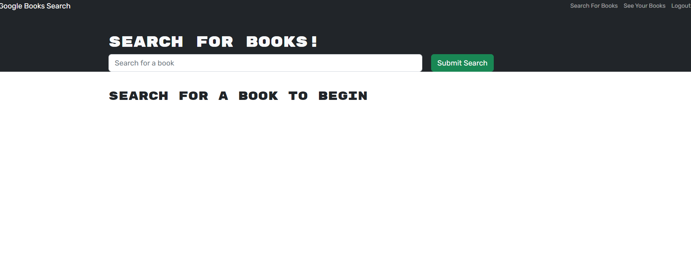
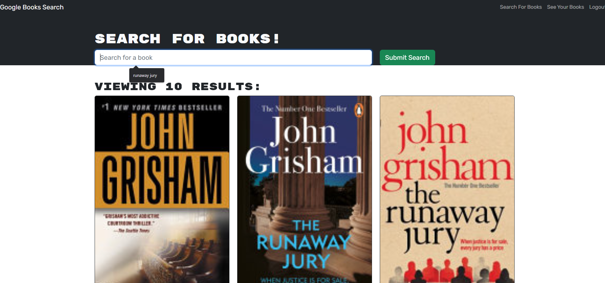
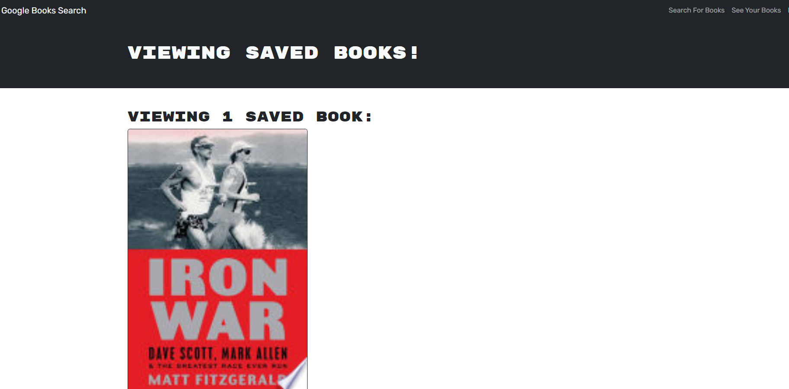

# Book_Worm_Engine/Book Search Engine

## Description

This application took a fully functioning Google Books API search engine built with a RESTful API and refactored it to be a GraphQL API built with an Apollo server. It is built using MERN stack with a React front end, MongoDB database, and Nodejs/Expressjs server and API.

## Table of contents

- [Installation](#installation)
- [Usage](#usage)
- [Contributions](#contributions)
- [Tests](#tests)
- [License](#license)
- [Questions](#questions)

## Installation

This is a fully deployed application. No installation required. Simply visit the deployed URL.

## Usage

A visitor will use this site one of two ways. They can either use it to simply search for books and browse, OR they can register with the site and then search for books and actually save them to their profile for future review.

---

## 

## Contributions

This application came with a fully built repository of starter code provided by UofM bootcamp. No other official contributors but plenty of help came from both tutor sessions, AskBCS, instructor and TA assistance as well as help from other students in the program.

## Tests

N/A

## License

MIT License

(https://opensource.org/licenses/MIT)

A short and simple permissive license with conditions only requiring preservation of copyright and license notices. Licensed works, modifications, and larger works may be distributed under different terms and without source code.

## Questions

If you have questions on this project you can find me on Github at https://github.com/JonahKane
or please feel free to email me at JonahTKane@gmail.com
